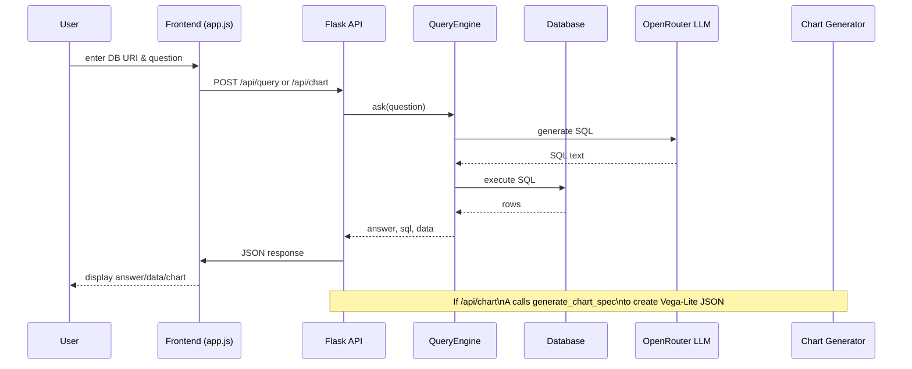

# Project Flowchart

This diagram summarises the main runtime path when a user asks a question or requests a chart.

The API also uses a `DBEmbedder` to suggest relevant tables
based on the question. These suggestions are included in the `/api/query` response.

